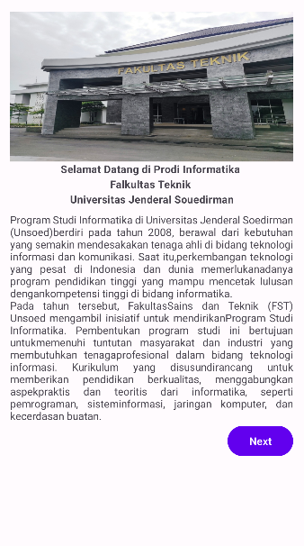
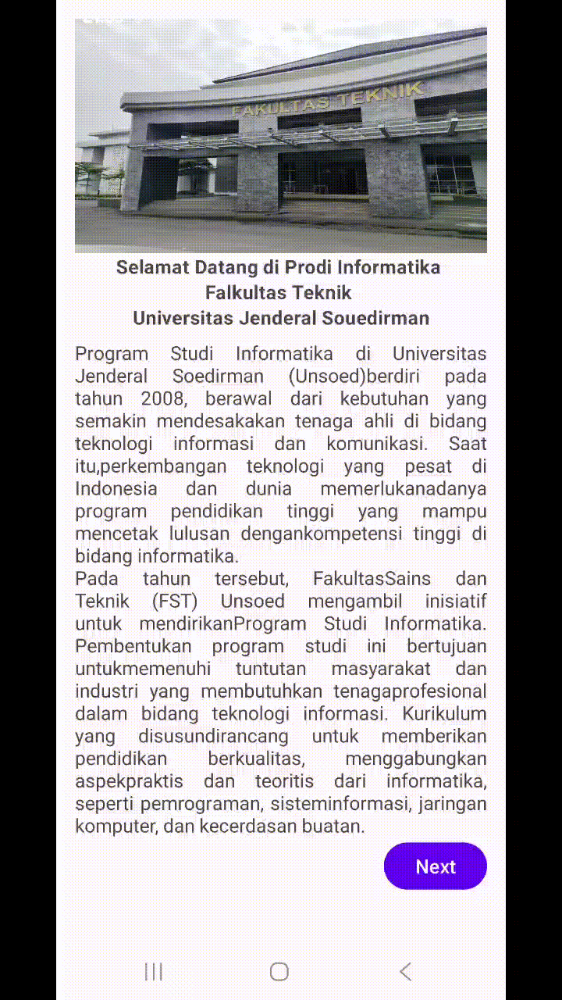

# Proyek IFUnsoedMobile

Repositori ini berisi proyek aplikasi mobile sederhana yang dibuat untuk memenuhi tugas praktikum.

## Profil Pengembang

- **Nama:** Yosafat Bagus Birawa
- **NIM:** H1D023109
- **Shift Lama:** D
- **Shift Baru:** D

## Deskripsi Singkat Aplikasi

Aplikasi ini menampilkan halaman selamat datang beserta deskripsi singkat mengenai Teknik Informatika Unsoed, serta tombol navigasi ke halaman berikutnya.

### Teknologi yang Digunakan
- Android Studio
- Bahasa Pemrograman Kotlin
- XML untuk Layout
- Material Design Components

## Pertemuan 2

## Pertemuan 3

